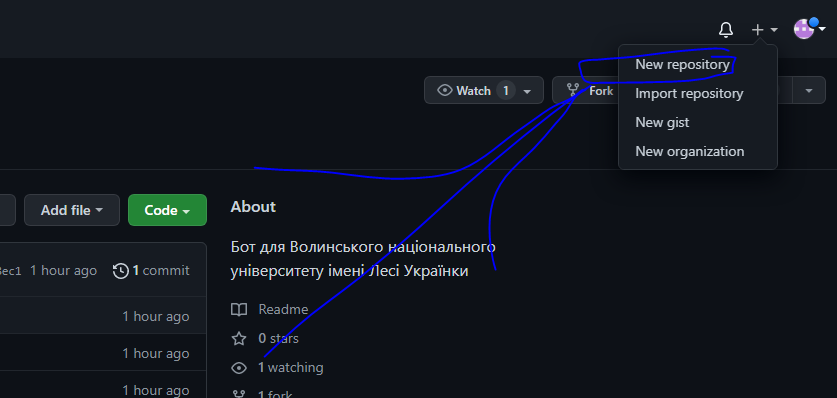
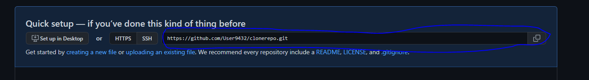

# Телеграм бот показу розкладу занять для Волинського національного університету імені Лесі Українки

## Як створити бота

Звертаємось до [BotFather](https://t.me/BotFather)

Пишемо: /newbot -> <Назва вашого  бота> -> <Нікнейм вашого бота(незмінний)>

та отримуєм унікальний токен формату:

```txt
0000000000:XXXXXXXXXXXXXXXXXXXXXXXXXXXXXXXXXX
```

## Хостинг бота (~5$/міс.)

Якщо ви хочете захостити бота на сервері, можна зробити це за недорогою (порівняно з іншими хостингами) ціною на сайті [Railway](https://railway.app)

Інструкція:

1. Створіть/зайдіть на свій аккаунт у [GitHub](https://github.com)
2. Створіть новий репозиторій<br>
   2.1. Нажміть у верхньому правому куті "+" -> "New repository"<br>
   <br>
   2.2. Введіть назву (немає різниці яку)<br>
   2.3. Нажміть "Create repository" нище<br>
   2.4. Скопіюйте/збережіть/запишіть https вашого проекту, це знадобиться потім<br>
   
3. Зайдіть у [репозиторій бота](https://github.com/RoLO0u/botforvuilu) (де ви зараз, скоріше всього, знаходитесь)
4. Завантажте [git](https://git-scm.com/downloads)
5. Запустіть Git Bash<br>
   5.1. Щоб запустити Git Bash на Windows зайдіть у папку, де тимчасово буде зберігатись репозиторій, нажміть ПКМ та виберіть "Git Bash here"
6. Впишіть у поле ```git clone https://github.com/RoLO0u/botforvuilu.git```
> ### Важливо!
> Git Bash НЕ підтримує Ctrl+V, тому щоб вставити використовуйте Shift+Insert
7. У файлі config.py впишіть токен вашого боту та посилання на сайт університету у відповідні змінні
8. У свому репозиторії на сайті GitHub у "Settings" -> "Danger Zone" (у самому низу) -> "Change visibility" -> "Make private" -> напишіть виділений текст -> "I understand, change repository visibility"
9. Просто впишіть у Git Bash ```cd botforvuilu``` -> ```rm -rf .git``` -> ```git init``` -> ```git add .``` -> ```git commit -m "Initiall commit"``` -> ```git remote add origin %HTTPS_ВАШОГО_РЕПОЗИТОРІЮ%``` -> ```git push -u origin master```<br>
   9.1. Під час вписування ```git remote add origin %HTTPS_ВАШОГО_РЕПОЗИТОРІЮ%``` у вас може відкритись github, там просто підтвердіть регістрацію через браузер
10. Зайдіть у [Railway](https://railway.app) та виберіть "Start a New Project" -> "Deploy from GitHub repo" -> "Login with GitHub" -> "Authorize Railway App" -> "Deploy from GitHub repo" -> "Verify Account"
11. Введіть данні ввашої карти (з карти буде знято і повернено 1$, для підтвердження особистості)
12. Зачекайте та нажміть "Go to Dashboard" -> "Create a New Project" -> "Deploy from GitHub repo" -> "Install & Authorize" -> "Deploy from GitHub repo" -> Виберіть ваш репозиторій -> "Deploy Now"
13. Вітаю! Ваш бот працює! Можете протестувати його роботу, також, за допомогою BotFather, ви можете його персоналізувати (Додати фото, опис...)!

### Якщо у вас виникли проблеми, під час ```git remote add origin %HTTPS_ВАШОГО_РЕПОЗИТОРІЮ%```, спробуйте змінити видимість назад "public", а вже після 9 кроку, знову змінити на "private"